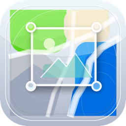
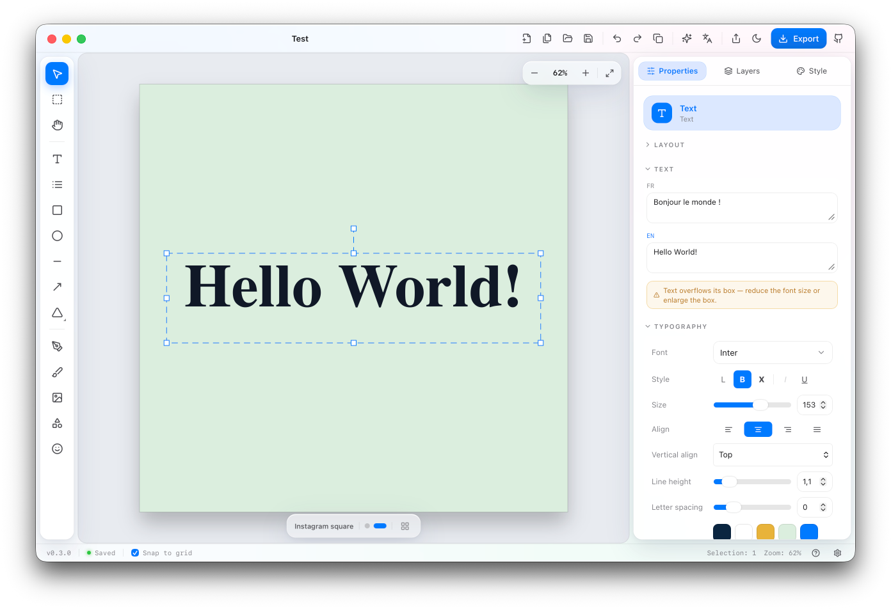

<p align="center">
  
</p>

<h1 align="center">Calqo</h1>

<p align="center">
  <strong>An open-source, local-first visual maker for static social posts.</strong>
</p>

Calqo is a focused design editor for making social-media visuals quickly:
Instagram posts and stories, YouTube thumbnails, LinkedIn banners, event cards,
announcements, and other static graphics that need to look polished without
opening a heavyweight design suite.

Calqo is built around the practical tools small teams, makers, and
communications people use every day: text, images, shapes, icons, artboards,
layers, exports, and templates. It keeps that workflow local-first,
open-source, and native-feeling, with a macOS-inspired "Liquid Glass"
interface.

The two headline AI workflows are different from image generation. Calqo asks an
LLM to produce the app's own editable project JSON, so a prompt can become a real
template with selectable layers. It can also keep per-language text variants in a
project and translate a design in place without rebuilding the layout.

Calqo (from _calque_, the French word for a design "layer") ships as a browser
React app with a Tauri macOS desktop build and a responsive phone editing
surface.

<p align="center">
  
</p>

## Download

The latest packaged alpha release is
[Calqo v0.4.0](https://github.com/kilianvivien/calqo/releases/tag/v0.4.0)
for macOS on Apple Silicon. It adds tablet and Apple Pencil support,
pressure-sensitive drawing, richer local agent drawing through MCP, and more
portable editable HTML/SVG typography.

The desktop build is ad-hoc signed, not Developer ID signed or notarized. On
first launch, macOS Gatekeeper may require approving the app manually.

## Status

**Public alpha, current app version 0.4.0.** The core editor is implemented and
usable locally: create projects, edit multi-artboard social visuals, save in the
browser or native desktop shell, export files, translate content, and generate
editable AI templates. The macOS desktop build includes localized native menus,
native `.calqo` open/save flows, secure desktop AI key storage, native
clipboard/image drop support, local font discovery, and Apple Silicon
`.app`/`.dmg` packaging. The browser app also includes a responsive phone
quick-edit surface, PWA install/update prompts, workspace overview, saved AI SVG
library, emoji insertion, app backup/restore, and multi-locale ZIP exports.

- [x] Vite + React + TypeScript project
- [x] Tailwind v4 + Liquid Glass design tokens & primitives
- [x] EN/FR app localization (`react-i18next`)
- [x] Theme (light/dark) + reduced-transparency modes
- [x] App shell skeleton (title bar, tab bar, tool rail, layers/artboards, canvas, inspector, status bar)
- [x] Zod project schema (versioned, migration-ready) + Dexie persistence
- [x] Browser adapter layer (storage, assets, file, clipboard, fonts)
- [x] Multi-project tab workspace with autosave + reload restore
- [x] Konva canvas editor (Phase B)
- [x] Layers, artboards, export (Phases C–D)
- [x] Multilingual content + AI flows (Phase E)
- [x] Prototype hardening pass (Phase F)
- [x] Graphics editing expansion: arrows, pen/freehand, pattern fills, SVG library (Phase G)
- [x] Gemini/GenAI provider reliability pass (Phase H)
- [x] Image crop/focal point, masks, filters, typography presets, effects (Phase I)
- [x] Faster inspector controls and multi-selection edits (Phase J)
- [x] Align/distribute/stack tools, smart guides, export readiness polish (Phase K)
- [x] GitHub chrome button and version metadata (Phase L implementation)
- [x] Public alpha docs, E2E smoke tests, sample project, diagnostics (Phase N)
- [x] Tauri desktop foundation: native menus, file flows, secure settings, packaging (Phase O)
- [x] Responsive phone quick-edit interface for browser/mobile use (Phase Q)
- [x] PWA install/update prompts and manifest assets
- [x] Modal keyboard shortcut isolation and focus-trap polish (`v0.1.7`)
- [x] Creative frames, stroke looks, sticker outlines, and mobile styling parity (Phase R)
- [x] Font/style controls, system font enumeration, and inspector section polish (`v0.2.2`)
- [x] Saved AI SVG library, emoji tool, and in-app glass confirmations (`v0.2.3`)
- [x] Workspace overview, ZIP export, backup/restore, and project duplicate/export (`v0.2.4`)
- [x] Editable background removal tool with stacked, non-destructive passes (`v0.2.5`)
- [x] Desktop crop reframe handles and workspace overview ring polish (`v0.2.6`)
- [x] Agent drawing: embedded desktop MCP server so coding agents draw editable layers live (`v0.3.0`)
- [x] Packaged GitHub release notes and Apple Silicon DMG for `v0.3.0`
- [x] Missing asset detection & repair, with status-bar badge and auto-opened repair modal
- [x] Asset optimization: oversized-import notices and one-step downscale/relink
- [x] 8 bundled starter templates plus user-saved starters with thumbnails
- [x] Brand profiles (lite): palettes, fonts, logos, and glossary applied in one undo step
- [x] Editable HTML export with Faithful/Approximated/Rasterized-fallback fidelity tiers
- [x] Packaged GitHub release notes and Apple Silicon DMG for `v0.3.5`
- [x] Pressure-sensitive brush strokes: Apple Pencil / stylus force maps to per-point widths (`v0.4.0`)
- [x] Tablet-ready desktop editor with touch gestures, long-press menus, and larger coarse-pointer controls
- [x] Typed MCP operations, apply-and-preview iteration, content-locale commands, and agent-supplied image insertion
- [x] One-click Agent Drawing setup for Codex, Claude Code, Antigravity, and OpenCode
- [x] Embedded used Google Font faces in editable HTML and SVG exports
- [x] Packaged GitHub release notes and Apple Silicon DMG for `v0.4.0`

## What you can make

Calqo is aimed at static social visuals and lightweight campaign assets:

- Square, portrait, story, thumbnail, banner, and custom-size artboards.
- Announcement cards, event posts, product updates, quote cards, basic ads, and
  multilingual public-information graphics.
- One project with several output sizes, for example an Instagram square plus a
  story version and a LinkedIn variant.
- Local project files you can export/import as `.calqo` JSON, alongside PNG,
  JPG, WebP, SVG, and HTML wrapper exports.

It is deliberately not a full publishing suite: no print/CMYK workflow, no
animation timeline, no realtime multiplayer, and no hosted template marketplace.

## Key features

- **Canvas editor:** text, images, shapes, icons/SVGs, layer ordering,
  selection, transforms, snapping, nudging, grouping, locking, visibility, and
  undo/redo.
- **Creative styling:** editable image frames, stroke looks, arrows, freehand
  marks, sticker outlines, pattern fills, masks, filters, typography presets,
  and effect-aware export warnings.
- **Mobile quick edit:** a responsive phone shell with project browsing,
  contextual toolbars, bottom sheets, text editing, SVG insertion, fill and
  stroke controls, sticker/frame chips, arrange/layers panels, translation, and
  mobile export/share paths.
- **Multi-artboard projects:** design several social sizes in one project, then
  duplicate or resize content into another preset. The workspace overview shows
  every artboard as a drag-reorderable grid with inline rename, duplicate,
  delete, and format-change actions.
- **Local-first storage:** browser projects are persisted with IndexedDB/Dexie,
  and the `.calqo` format is validated through the shared project schema. Saved
  projects can be duplicated/exported individually, and the backup flow exports
  projects plus non-secret settings to a `.calqobackup` file.
- **Export workflow:** PNG/JPG/WebP with scale options, SVG with fidelity
  warnings, HTML wrapper or editable HTML (real text/image/shape nodes with a
  Faithful/Approximated/Rasterized-fallback fidelity report and envelope-size
  warning), batch export, ZIP bundles for multi-artboard or multi-locale
  output, and clipboard/share paths where the browser supports them.
- **Asset health:** missing-asset detection with an auto-opened repair modal
  (relink, remove, or keep placeholders) and oversized-import detection with
  one-step downscale/relink, both surfaced in the diagnostics pane.
- **Starters & brand profiles:** 8 bundled starter templates plus user-saved
  starters, and Brand profiles (lite) for palettes, fonts, logos, and glossary
  terms that apply in one undo step and seed AI template generation.
- **Multilingual content:** text layers can store variants per content locale,
  so switching from French to English or Turkish changes the design content, not
  the app chrome. Export can target the active locale or every project locale in
  per-locale ZIP folders.
- **Prompt-a-template:** describe a design and get an editable Calqo project
  instead of a flattened image.
- **Reusable generated assets:** AI-generated SVG marks can be saved to a local
  "Generated" category, deleted later, and reused from the desktop or mobile SVG
  picker.
- **Fast decorative text:** the emoji tool inserts selected emoji as editable
  text layers using the OS emoji font.
- **Bring-your-own AI provider:** AI is off until a provider is configured;
  Gemini has a provider-specific GenAI path, while OpenAI-compatible,
  Ollama/local, Mistral, OpenRouter, and custom endpoints are supported through
  the provider layer.
- **Liquid Glass UI:** light/dark themes, translucent glass panels, and a
  reduced-transparency mode for accessibility.
- **Desktop shell:** native menus, file open/save, clipboard/image-drop support,
  local font discovery, secure AI key storage, and packaged Apple Silicon DMGs
  through Tauri.
- **Agent drawing (desktop):** an opt-in local MCP server lets coding agents
  such as Claude Code draw editable layers live in the running app — off by
  default, loopback-only with a pairing token, one in-app approval per session,
  every agent batch is a single undo step, and an activity log shows each call.
  Agents receive typed drawing schemas and a one-call apply-and-preview loop.
  Enable it in Settings ▸ Agent drawing, which includes one-click setup plus
  guided copy-paste fallbacks for Claude Code, Codex, Antigravity, OpenCode,
  and other Streamable HTTP clients.

## Tech stack

React 19 · TypeScript · Vite · Tailwind v4 · Konva / react-konva · Zustand ·
Dexie · Zod · react-i18next · lucide-react.

## Getting started

Calqo uses `pnpm`.

To try the packaged desktop alpha, download the DMG from the
[latest release](https://github.com/kilianvivien/calqo/releases/latest). To run
from source:

```bash
pnpm install
pnpm dev         # Vite dev server on http://localhost:5173
pnpm typecheck   # TypeScript only
pnpm test        # Vitest unit tests
pnpm e2e         # Playwright public-alpha smoke tests
pnpm lint        # ESLint
pnpm build       # type-check and production build
pnpm tauri:dev   # native desktop shell
pnpm tauri:build # macOS .app and .dmg artifacts
```

Before committing, run `pnpm typecheck` and `pnpm test`.

## Architecture notes

Calqo is designed so the browser app can grow into a Tauri desktop app without
rewriting the editor.

App/editor code stays behind adapters in `src/lib/adapters/` for storage,
assets, files, clipboard, fonts, and app settings. Browser builds use Dexie,
Blob, and web Clipboard APIs; the Tauri shell swaps in native file dialogs,
Stronghold-backed secure settings, system clipboard image access, and local font
enumeration through the same boundary.

Project JSON is the product contract. The Zod schema in `src/lib/schema/`
validates persisted documents, `.calqo` imports, and AI-generated templates via
`safeImportProject`. Imported projects always receive a fresh project id so they
do not overwrite open tabs.

Mutations flow through `src/editor/commands/projectCommands.ts`, which marks
projects dirty, schedules autosave, and coordinates selection/history cleanup.
The test suite covers autosave coalescing, close/reload flushing, import id
collisions, save-error surfacing, export behavior, AI validation, and the later
editing-depth passes.

## AI providers

AI is off by default until a provider is configured. Gemini uses a
provider-specific GenAI adapter with structured JSON requests for templates and
translations. Local Ollama, Mistral, OpenRouter, and custom endpoints continue
through the OpenAI-compatible adapter. Browser API keys are only persisted after
explicit opt-in and are stored in IndexedDB for this site; the Tauri app stores
provider keys separately in Stronghold-backed secure storage and keeps them out
of exported `.calqo` project files.

## Browser compatibility

The core path is intended for current Chrome and Safari: create/edit, local
save/reload, `.calqo` import/export, raster export, HTML wrapper export, and mock
AI flows. Firefox should handle core editing, but image clipboard writes and
some export/clipboard permissions can be limited by browser support; Calqo now
reports unsupported copy operations instead of throwing.

## Known limitations

- The macOS DMG is currently Apple Silicon only and is ad-hoc signed, not
  Developer ID signed or notarized, so Gatekeeper may require manual approval
  on first launch.
- Calqo focuses on static social visuals, not animation/video.
- SVG export is intentionally limited and warns for unsupported fidelity.
- SVG export approximates some creative frame, sticker, glow, double, offset,
  outline, and marker stroke looks; use PNG for pixel-faithful output.
- Clipboard behavior depends on browser permissions and feature support.
- Agent drawing (MCP) is desktop-only and experimental. Agents can create and
  edit layers, manage content locales, and insert bounded PNG/JPEG/WebP image
  data, but cannot export files yet. The pairing token grants drawing access to
  any local process that has it — treat it like a local secret and regenerate
  it if in doubt.
- Complex vector editing, signing/notarization, and production-grade
  phone-first editing remain future work.

## Design language

Calqo targets the macOS "Liquid Glass" material: translucent, layered,
light-refracting surfaces over a soft wallpaper. A small CSS-variable token
system (`src/styles/tokens.css`) drives color, blur, radius, and motion across
light/dark themes, with a reduced-transparency fallback for accessibility.

## License

[MIT](LICENSE) © Kilian Vivien
