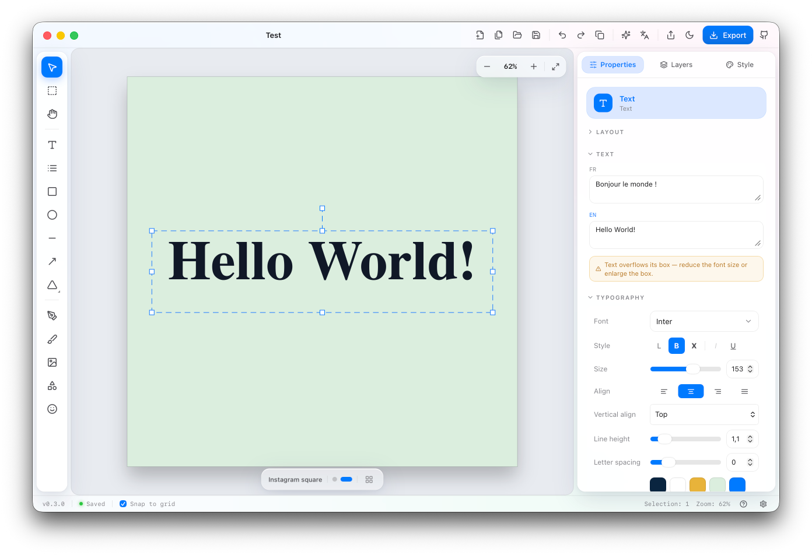

<p align="center">
  
</p>

<h1 align="center">Calqo</h1>

<p align="center">
  <strong>Make polished social graphics. Keep every layer editable.</strong>
</p>

<p align="center">
  The open-source, local-first visual maker for social content —<br />
  the focused 20% of Canva, without the cloud-suite weight.
</p>

<p align="center">
  <a href="https://github.com/kilianvivien/calqo/releases/latest"><strong>Download for macOS</strong></a>
  ·
  <a href="#animate-mode">Animate mode</a>
  ·
  <a href="#run-from-source">Run from source</a>
  ·
  <a href="#agent-drawing">Connect an AI agent</a>
</p>

<p align="center">
  
  
  
</p>

<p align="center">
  
</p>

## Design fast. Own the result.

Calqo is built for the graphics people make every week: Instagram posts and
stories, YouTube thumbnails, LinkedIn banners, event cards, announcements,
quote cards, campaign variants, and multilingual public information.

- **A real canvas, not a form.** Arrange text, images, shapes, SVGs, lists, and
  freehand marks with layers, snapping, transforms, grouping, and undo/redo.
- **Editable all the way down.** AI templates and agent-made designs remain
  normal Calqo layers. Text stays text. Images stay replaceable. Nothing is
  flattened unless you export it that way.
- **Local by default.** Projects live on your device. The `.calqo` format is
  open JSON, validated by a versioned schema, and easy to back up or move.
- **One design, many outputs.** Keep multiple artboards and content languages
  in one project, then export individual files or organized ZIP bundles.
- **Now it moves.** Switch a finished design into Animate mode, apply
  enter/emphasis/exit presets, and export MP4, GIF, or animated HTML — rendered
  locally, no cloud renderer.
- **Focused on social work.** No publishing calendar, stock-media upsell, or
  enterprise suite to navigate around.

## What Calqo can do

| Area                 | Capabilities                                                                                                                    |
| -------------------- | ------------------------------------------------------------------------------------------------------------------------------- |
| **Canvas**           | Multi-select, resize, rotate, snap, align, distribute, stack, group, lock, hide, reorder, crop, and undo/redo                   |
| **Content**          | Text, images, rectangles, ellipses, lines, arrows, polygons, pressure-sensitive brushes, lists, emoji, and reusable SVGs        |
| **Styling**          | Gradients, patterns, masks, filters, image frames, typography presets, shadows, blend modes, stroke looks, and sticker outlines |
| **Formats**          | Square and portrait posts, stories, thumbnails, banners, custom sizes, and multi-artboard projects                              |
| **Starters & brand** | 42 categorized starter models, saved personal models, palettes, fonts, logos, and glossary-aware brand profiles                 |
| **Languages**        | Per-locale text variants inside one design, in-place AI translation, and locale-grouped exports                                 |
| **Animation**        | Animate mode with effects or simple transform keyframes, text reveals, multi-scene clips, transitions, and live playback        |
| **Export**           | PNG, JPEG, WebP, SVG, editable HTML, raster fallback, clipboard/share paths, batch export, and ZIP bundles                      |
| **Video export**     | Local MP4 (H.264/H.265) and capped GIF, hardware-encoded on Apple Silicon, plus self-contained animated HTML                    |
| **Asset safety**     | Missing-asset detection and repair, oversized-image notices, one-step downscale/relink, project backup and restore              |
| **AI templates**     | Prompt-to-template generation that produces validated, editable Calqo project JSON instead of a flat picture                    |
| **Agent drawing**    | A local MCP server lets Codex, Claude Code, Antigravity, OpenCode, and other agents draw directly in the live desktop app       |
| **Touch & stylus**   | Responsive phone quick-edit UI, tablet gestures, coarse-pointer controls, long-press menus, and pressure-aware brush strokes    |
| **Desktop**          | Native macOS menus, `.calqo` open/save, image drop and clipboard support, local font discovery, and secure AI-key storage       |

## Calqo 0.6.0 — Simple motion, your way

Calqo's Animate mode now includes a deliberately compact keyframe editor. Pick
**Keyframes** for a layer, move the playhead, then drag, resize, or rotate the
object directly on the canvas. Calqo records the whole pose automatically and
shows it as one diamond in the existing transport — no property stack, graph
editor, or second timeline.

- Position, scale, and rotation share one easy-to-read pose.
- Start and end poses are created automatically; add or remove intermediate
  poses from the selected layer's single timeline lane.
- Clicking a diamond seeks to it, and canvas edits at any playhead create or
  update that pose.
- Keyframe edits use the same validated custom-track format as playback, MP4,
  GIF, and animated HTML export, with full undo/redo.
- Effects and keyframes stay explicit alternatives per layer, keeping the UI
  and the saved animation source of truth unambiguous.

## Calqo 0.5.0 — Calqo moves

The biggest release since the editor itself: static designs can now become
short animated clips, without leaving the app or touching a cloud renderer.

- **Animate mode.** Flip any artboard from Design to Animate, then give layers
  `enter`, `emphasis`, and `exit` presets — fade, slide, pop, rise, wipe, blur,
  pulse, wiggle, and float — with per-slot duration, delay, direction,
  distance, and easing.
- **Text reveals.** Typewriter and word-rise presets animate text
  character-by-character or word-by-word, and stay real text throughout.
- **Live playback.** A transport bar plays, pauses, restarts, and scrubs the
  clip on the real Konva canvas, so the preview is the renderer that exports.
- **Multi-scene clips.** Sequence several artboards into one clip joined by
  cut, fade, or slide transitions, up to 60 seconds total.
- **Local video export.** MP4 (H.264, with H.265 where supported) and a capped
  GIF fallback, encoded on your machine with progress, cancellation, and honest
  capability reporting. The macOS build ships a native VideoToolbox encoder and
  falls back to WebCodecs when hardware encoding is unavailable.
- **Animated HTML.** A self-contained animated HTML file, or a neutral handoff
  package a coding agent can take further.
- **Agents can animate.** The MCP surface gained validated animation
  operations — set/clear presets, custom windows, scene duration, frame rate,
  scene order, and transitions — routed through the same undoable command path
  as manual edits.

Static PNG/JPEG/WebP/SVG/HTML export behavior is unchanged, and `.calqo`
projects migrate to schema v2 automatically.

See the complete history on the
[Releases page](https://github.com/kilianvivien/calqo/releases).

## Download

Download **Calqo 0.6.0 for macOS on Apple Silicon** from the
[latest GitHub release](https://github.com/kilianvivien/calqo/releases/latest).

The current desktop build is ad-hoc signed, not Developer ID signed or
notarized. On first launch, macOS Gatekeeper may require you to approve Calqo
manually in System Settings.

Calqo is a public alpha. The editor is useful today, but project compatibility,
packaging, and experimental features may still change before 1.0.

## Animate mode

Animation is an extra layer on top of a finished design, not a separate
document. Switch the editor from **Design** to **Animate**, select a layer, and
give it up to three preset slots:

| Slot         | Presets                                                   |
| ------------ | --------------------------------------------------------- |
| **Enter**    | Fade, slide, pop, rise, wipe, blur, typewriter, word rise |
| **Emphasis** | Pulse, wiggle, float                                      |
| **Exit**     | Fade, slide, pop, wipe, blur                              |

Each slot takes a duration, delay, direction, distance, and easing (including
overshoot and bounce). The transport bar plays and scrubs the result on the
real canvas.

A few properties worth knowing:

- **Your design is never rewritten.** Animation runs on a transient wrapper
  node: offsets are additive, scale is multiplicative, and document geometry
  stays exactly as you left it. Turning animation off restores the static
  design bit-for-bit.
- **Presets are the document.** Calqo stores the preset, not baked keyframes,
  and compiles it to a keyframe IR on demand — so files stay small, portable,
  and re-editable.
- **One renderer.** Live playback, MP4, and GIF all render through the same
  Konva path, so the preview matches the export. Animated HTML is a separate
  target and reports its own fidelity limits.

Export from the same dialog as everything else. MP4 and GIF appear once the
active artboard has animation; GIF is capped in duration, size, and frame rate
to keep files and memory sane, and the dialog explains any adjustment it makes.

The macOS app encodes MP4 with a native VideoToolbox (Apple Silicon hardware)
encoder, and falls back to the in-WebView WebCodecs encoder when that is
unavailable. **Settings → Video encoder** lets you pin the choice — _Automatic_
(default), _Hardware_, or _WebCodecs_ — which is useful for comparing output or
working around a driver issue. A preference never causes a failed export; if the
preferred backend can't start, Calqo falls back.

## Agent drawing

Calqo's desktop app can expose an opt-in MCP server on loopback so a coding
agent can work on the document you have open.

An agent can:

- inspect the active project, artboard, layers, palette, selection, and revision;
- add, update, delete, reorder, group, and ungroup editable layers;
- manage content locales and create multi-language variants;
- apply a batch as one undo step and receive a fresh preview immediately;
- generate or download a raster image, save it locally, and insert it with
  `calqo_insert_image` using its absolute file path.

Enable it under **Settings → Agent drawing**. Calqo includes one-click setup for
Codex, Claude Code, Antigravity, and OpenCode, plus connection details for any
Streamable HTTP MCP client.

The server is off by default, bound to `127.0.0.1`, protected by a pairing
token, and gated by in-app write approval. The token grants access to local
processes that possess it, so treat it as a local secret and regenerate it if
it is ever exposed.

## AI without lock-in

Calqo separates two useful AI jobs:

1. **Prompt to editable template:** the provider returns Calqo project JSON,
   which is validated before it reaches the editor.
2. **Translate content in place:** text variants change while the design,
   geometry, and source language remain intact.

AI is off until you configure a provider. Gemini has a provider-specific GenAI
path; OpenAI-compatible endpoints, Ollama/local models, Mistral, OpenRouter,
and custom endpoints are supported through the provider layer.

Browser keys are persisted only after explicit opt-in. The Tauri app stores
provider keys separately in Stronghold-backed secure storage. Keys are never
written into `.calqo` projects or app backups.

## Run from source

Calqo uses Node.js, Rust, and `pnpm`.

```bash
pnpm install
pnpm dev         # browser app at http://localhost:5173
pnpm tauri:dev   # macOS desktop shell
```

Useful checks and builds:

```bash
pnpm typecheck
pnpm test
pnpm lint
pnpm build
pnpm e2e
pnpm tauri:build     # macOS .app and .dmg, WebCodecs encoding only
pnpm tauri:build:mac # release build: adds the native VideoToolbox encoder
```

Release builds use `pnpm tauri:build:mac`, which passes
`--features video-toolbox`. That Cargo feature is off by default so the crate
still builds on non-macOS hosts, where the AVFoundation FFI cannot compile.

## Architecture

Calqo is a React 19 + TypeScript editor rendered with Konva and packaged with
Tauri. Zustand + Immer manage editor state, Dexie stores browser projects and
blobs, Zod defines the project contract, Tailwind v4 provides the UI system,
and react-i18next keeps the app chrome localized in English and French.

The important boundaries are deliberate:

- `src/lib/schema/` is the project contract for persistence, imports, and AI.
- `src/editor/commands/` owns project mutations, history, and autosave behavior.
- `src/lib/adapters/` separates browser storage and APIs from native Tauri
  implementations.
- `src/editor/mcp/` validates and executes agent operations through the same
  command path as manual edits.
- `src/editor/export/` owns raster, SVG, HTML, ZIP, and multi-locale export.
- `src/editor/animation/` compiles animation presets to the keyframe IR that
  live playback and every animated exporter share.

## Current scope

Calqo deliberately focuses on RGB social graphics. It does not currently offer
print/CMYK production, realtime multiplayer, a hosted publishing calendar, or a
template marketplace.

Animation is motion applied to a static design, not a video editor. Calqo offers
presets and one compact whole-pose keyframe lane for the selected layer; there
is no property timeline or graph editor, audio track, or imported video/GIF
footage. Clips are capped at 60 seconds. Animate mode is desktop-only — the
phone layout stays a static quick-editor.

The packaged release is currently Apple Silicon only. SVG and editable HTML
exports report fidelity limits for effects that cannot be represented exactly;
use raster export when pixel-perfect rendering matters.

## Contributing

Issues and pull requests are welcome. Before committing, run:

```bash
pnpm typecheck
pnpm test
```

Product direction and implementation status live under [`docs/`](docs/).

## License

[MIT](LICENSE) © Kilian Vivien
