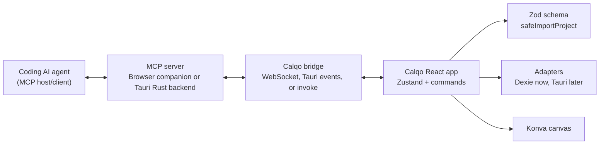
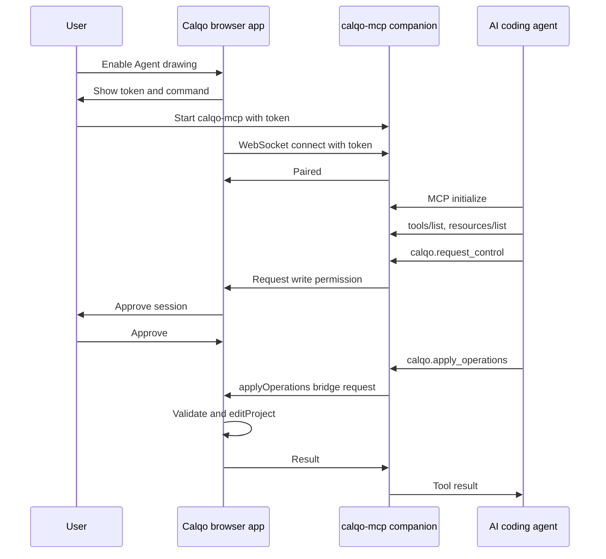

# Calqo MCP Live Drawing Implementation Plan

**Status:** Superseded by `docs/calqo-tauri-agent-drawing-plan.md` (2026-07-02).
The feature is now planned as Tauri-only with an embedded Rust MCP server; the
browser companion/WebSocket path described below is not being built. Kept for
reference on tool surface, operation design, and safety analysis.  
**Last updated:** 2026-06-20  
**Related docs:** `PRD-calqo-v0.5.md`, `calqo-browser-prototype-implementation-plan.md`, `calqo-project-maker.skill`

## 1. Goal

Add a local MCP integration so coding AI agents can connect to Calqo and create
or modify editable social graphics by calling structured tools instead of
flattening images.

The desired workflow:

1. A user opens Calqo and enables "Agent drawing".
2. Calqo exposes or connects to a local MCP server.
3. A coding agent connects to that server.
4. The agent reads Calqo context: active project, artboards, schema, selected
   layers, design tokens, export constraints, and allowed operations.
5. The agent calls tools such as `create_project`, `apply_operations`,
   `insert_svg`, `translate_content`, and `export_artboard`.
6. Calqo validates every proposed document or operation through the existing
   schema and command system.
7. The canvas updates live, remains editable, and autosaves through the normal
   project pipeline.

The result should feel like this:

> "Ask the local agent to make a 1080 x 1080 launch card, watch editable text
> and shape layers appear in Calqo, then keep prompting until the design is good."

## 2. Constraints and key decisions

### 2.1 Browser apps cannot truly spawn servers

The browser version of Calqo cannot start a local process or bind a local port.
That is a hard browser sandbox constraint.

For the browser app, use a companion local process:

- The user or the agent starts `calqo-mcp`.
- `calqo-mcp` exposes MCP to the agent over stdio or Streamable HTTP.
- The browser app opens an outbound WebSocket connection to `calqo-mcp` on
  `127.0.0.1`.
- A short-lived pairing token links the browser session to the MCP server.

For the Tauri app, prefer an embedded Rust-native MCP server:

- The Tauri Rust backend can run the MCP server in-process.
- The server listens on `127.0.0.1` while Agent drawing is enabled.
- MCP tool handlers forward validated operations to the frontend through Tauri
  events/invoke plumbing, or later call shared Rust-side state if Calqo moves
  more editor logic native.
- No separate sidecar executable is required for this path.

A Tauri sidecar remains a useful fallback if Calqo wants to reuse the same
TypeScript `calqo-mcp` companion used by the browser app, but it should not be
the default long-term desktop design.

### 2.2 Calqo should own state and validation

The MCP server must not mutate Zustand stores directly. It should submit
validated operations to an editor command bridge that wraps the existing
`src/editor/commands/projectCommands.ts` functions.

Important existing surfaces:

- `src/lib/schema/schema.ts`: the editable project contract.
- `safeImportProject`: strict validation for imported or AI-generated projects.
- `src/editor/commands/projectCommands.ts`: project mutation entry point,
  autosave scheduling, history snapshots, selection updates, artboard and layer
  commands.
- `src/editor/export/calqoFile.ts`: portable `.calqo` envelope import/export.
- `src/editor/ai/promptTemplateService.ts`: prompt-to-template generation and
  validation path.
- `src/editor/ai/agentSkillFile.ts`: existing static "agent writes `.calqo`"
  skill, which becomes the low-tech fallback and documentation seed.

### 2.3 Prefer command-level operations over arbitrary patches

Do not expose a generic "write any project JSON" tool as the default live path.
It is too easy for an agent to break invariants, bypass history, or clobber user
work.

Expose a small command language instead:

- Add layer.
- Update layer fields.
- Delete layer.
- Reorder layer.
- Group or ungroup layers.
- Add artboard.
- Set active artboard.
- Set content locale.
- Apply translation result.
- Replace entire project only through the same importer/validator used by
  `.calqo`.

Use whole-project replacement only for "create from scratch" or explicit
`replace_project` operations.

### 2.4 Live drawing needs transactions

Agents will iterate. Calqo should support draft previews:

1. `begin_transaction`
2. `apply_operations` with `mode: "preview"`
3. User sees proposed edits.
4. `commit_transaction` or `rollback_transaction`

For a first version, each `apply_operations` call can be atomic and undoable.
Later, a transaction can accumulate multiple operations into one undo step.

## 3. Relevant external docs

MCP is a JSON-RPC based client/server protocol with a data layer and transport
layer. Servers expose three main primitives:

- Tools: executable functions that agents can call.
- Resources: read-only context.
- Prompts: reusable interaction templates.

The protocol supports local stdio transport and Streamable HTTP transport.
Stdio is best when the AI host launches the MCP server as a child process.
Streamable HTTP is useful for long-lived local services and multi-client access.

Current TypeScript SDK note, as of 2026-06-20:

- The `modelcontextprotocol/typescript-sdk` main branch documents a v2 API, but
  the repository says v2 is still pre-alpha and v1.x remains the production
  recommendation until the updated spec stabilizes.
- Initial Calqo implementation should pin stable v1.x, such as v1.29.0, unless
  this plan is implemented after v2 has shipped and the API has settled.

Tauri v2 supports bundled external binaries, called sidecars, through
`bundle.externalBin`. A Tauri sidecar binary must be named with a target-triple
suffix for each platform. The shell plugin can spawn the sidecar, and capability
permissions must explicitly allow that sidecar executable. This is useful for a
TypeScript/Node MCP server reuse path, but a Rust-native MCP server embedded in
the Tauri backend can avoid sidecar packaging entirely.

The official Rust MCP SDK supports server tool routing and built-in stdio and
Streamable HTTP transports. For Calqo's Tauri app, Streamable HTTP on loopback is
the relevant transport because external MCP hosts need a local endpoint to
connect to; the server can still live inside the Tauri process.

References:

- MCP architecture: https://modelcontextprotocol.io/docs/learn/architecture
- MCP server concepts: https://modelcontextprotocol.io/docs/learn/server-concepts
- MCP server guide: https://modelcontextprotocol.io/docs/develop/build-server
- TypeScript SDK: https://github.com/modelcontextprotocol/typescript-sdk
- Rust SDK: https://github.com/modelcontextprotocol/rust-sdk
- Tauri sidecars: https://v2.tauri.app/develop/sidecar/
- Tauri Node.js sidecar guide: https://v2.tauri.app/learn/sidecar-nodejs/

## 4. Proposed architecture

### 4.1 Components



### 4.2 Packages and file layout

Start with a clear separation between MCP protocol code and editor execution:

```text
src/
  editor/
    mcp/
      commandBus.ts
      operationSchemas.ts
      operationExecutor.ts
      contextSerializers.ts
      pairing.ts
      auditLog.ts
  lib/
    schema/
      schema.ts
      mcpSchemas.ts

packages/
  calqo-mcp/
    src/
      index.ts
      server.ts
      transports/
        stdio.ts
        streamableHttp.ts
      bridge/
        websocketClient.ts
        websocketServer.ts
      tools/
        projectTools.ts
        layerTools.ts
        exportTools.ts
        aiTools.ts
      resources/
        projectResources.ts
        schemaResources.ts
      prompts/
        designPrompts.ts
```

If the repo stays single-package for a while, keep the MCP server under
`tools/calqo-mcp/` instead of `packages/`. The key is that browser code and Node
server code do not accidentally import each other's runtime-only APIs.

### 4.3 Runtime modes

#### Mode A: Browser plus companion MCP process

Best for the current browser-first Calqo prototype.

1. User opens Calqo in the browser.
2. User opens "Agent drawing" from settings or the title bar.
3. Calqo shows a command:

   ```bash
   npx calqo-mcp --port 3847 --pairing-token 123456
   ```

4. The user configures their agent to launch `calqo-mcp` over stdio, or to
   connect to its Streamable HTTP endpoint.
5. Browser Calqo connects to `ws://127.0.0.1:3847/app?token=123456`.
6. The MCP server only accepts write tools after the browser session is paired.

This mode lets any local coding agent draw into the running browser app without
browser-native process spawning.

#### Mode B: Tauri app with embedded Rust MCP server

Best for the desktop version.

1. User enables Agent drawing in the Tauri app.
2. The Rust backend starts an in-process MCP service bound to `127.0.0.1`.
3. The service exposes Streamable HTTP on a random or configured loopback port.
4. MCP tool handlers validate permissions and forward operation requests into
   the Calqo frontend through Tauri events or invoke commands.
5. The frontend executes operations through the same `src/editor/mcp` executor
   and `projectCommands.ts` mutation path used by browser mode.

This avoids sidecar packaging, target-triple executable naming, and Node runtime
bundling. It still exposes a local MCP endpoint because outside agents cannot
call private Tauri functions directly.

The Rust MCP SDK server shape should look roughly like:

```rust
use rmcp::{
    handler::server::wrapper::Parameters,
    schemars,
    tool,
    tool_router,
    ServiceExt,
};

#[derive(Clone)]
struct CalqoMcpServer {
    app: tauri::AppHandle,
}

#[derive(Debug, serde::Deserialize, schemars::JsonSchema)]
struct ApplyOperationsParams {
    project_id: String,
    artboard_id: String,
    operations: serde_json::Value,
}

#[tool_router(server_handler)]
impl CalqoMcpServer {
    #[tool(description = "Apply validated editable Calqo operations")]
    async fn apply_operations(
        &self,
        Parameters(params): Parameters<ApplyOperationsParams>,
    ) -> Result<String, String> {
        // Forward into the Calqo frontend executor via Tauri event/invoke
        // plumbing, then return the structured tool result as JSON.
        todo!("bridge to src/editor/mcp operation executor")
    }
}
```

#### Mode C: Tauri app with bundled sidecar fallback

This path is useful if Calqo wants to ship the browser companion's TypeScript MCP
server before the Rust-native server is ready.

1. Tauri starts `calqo-mcp` as a sidecar when the user enables Agent drawing.
2. Tauri passes a random token and an app bridge port through arguments or env.
3. The Calqo frontend connects to the sidecar, or Rust forwards events between
   the sidecar and frontend.
4. The sidecar exposes Streamable HTTP on loopback.

The sidecar fallback needs Tauri config like:

```json
{
  "bundle": {
    "externalBin": ["binaries/calqo-mcp"]
  }
}
```

And a shell capability similar to:

```json
{
  "permissions": [
    "core:default",
    {
      "identifier": "shell:allow-execute",
      "allow": [
        {
          "name": "binaries/calqo-mcp",
          "sidecar": true,
          "args": true
        }
      ]
    }
  ]
}
```

### 4.4 Why not put the MCP server inside the browser?

MCP clients need to connect to a process or HTTP endpoint. A browser tab can
make outbound requests but cannot become a local server, cannot accept stdin,
and cannot be launched by an AI host. The companion process is the bridge across
that sandbox.

## 5. MCP surface design

### 5.1 Resources

Resources should be read-only and safe to include as model context.

Recommended resources:

| URI | Purpose |
| --- | --- |
| `calqo://app/status` | Paired state, active project id, active artboard id, selected layer ids, capabilities. |
| `calqo://schema/project` | Current Calqo project JSON schema summary and generation rules. |
| `calqo://schema/operations` | MCP operation schema and examples. |
| `calqo://project/{projectId}` | Full editable project JSON, optionally redacted or summarized for large assets. |
| `calqo://project/{projectId}/summary` | Compact project, artboard, layer, locale, and palette summary. |
| `calqo://project/{projectId}/artboard/{artboardId}` | One artboard's editable JSON. |
| `calqo://project/{projectId}/artboard/{artboardId}/preview` | Data URL or exported PNG preview. |
| `calqo://design/tokens` | Relevant Calqo Liquid Glass design tokens and system guidance. |
| `calqo://presets/artboards` | Social preset ids and dimensions. |
| `calqo://agent/skill` | The existing Calqo project-maker skill text as fallback guidance. |

Keep asset blobs out of default context. Provide explicit asset resources only
when the user approves or when the asset is already embedded in a `.calqo`
envelope.

### 5.2 Prompts

Prompts help agent hosts use the server correctly.

Recommended prompts:

| Prompt | Purpose |
| --- | --- |
| `make_social_post` | Gather brief, choose preset, create editable layers, commit. |
| `adapt_to_artboard` | Duplicate or adapt active artboard to another social size. |
| `localize_design` | Add a locale and translate text/list layers. |
| `critique_and_refine` | Read preview and project JSON, then propose targeted edits. |
| `export_ready_check` | Check contrast, bounds, overflow, missing locales, and export readiness. |

Prompts should instruct agents to prefer editable text, shapes, lists, and SVG
layers over rasterized output.

### 5.3 Tools

Tool names should be stable, descriptive, and prefixed with `calqo.`.

Core connection tools:

| Tool | Purpose |
| --- | --- |
| `calqo.get_status` | Return pairing status, active project, active artboard, selection, and capabilities. |
| `calqo.request_control` | Ask Calqo UI for write permission for this agent/session. |
| `calqo.release_control` | End the write session. |

Project tools:

| Tool | Purpose |
| --- | --- |
| `calqo.list_projects` | List open and saved projects through the storage adapter. |
| `calqo.create_project` | Create a default project from preset/name/locale/palette. |
| `calqo.import_project` | Import a full project or `.calqo` envelope through `safeImportProject`. |
| `calqo.replace_project` | Replace active project only after validation and user approval. |
| `calqo.save_project` | Flush pending autosave. |
| `calqo.export_project_file` | Return or save a `.calqo` envelope. |

Artboard and layer tools:

| Tool | Purpose |
| --- | --- |
| `calqo.apply_operations` | Apply a validated list of command-level operations atomically. |
| `calqo.add_layer` | Add one layer to an artboard. |
| `calqo.update_layer` | Patch allowed layer fields. |
| `calqo.delete_layers` | Delete target layers. |
| `calqo.reorder_layer` | Reorder top-level layers. |
| `calqo.group_layers` | Group target layers. |
| `calqo.ungroup_layer` | Ungroup a group layer. |
| `calqo.duplicate_artboard_to_preset` | Use existing artboard duplication/scaling behavior. |

AI and content tools:

| Tool | Purpose |
| --- | --- |
| `calqo.generate_template` | Call Calqo's configured AI provider path and adopt the validated result. |
| `calqo.validate_template` | Validate an agent-generated project without importing it. |
| `calqo.add_content_locale` | Add locale to project. |
| `calqo.apply_translation` | Apply translated text/list content through existing translation commands. |

Asset and export tools:

| Tool | Purpose |
| --- | --- |
| `calqo.insert_svg` | Sanitize and import an SVG asset, then add an SVG layer. |
| `calqo.insert_asset_data_url` | Add a user-approved raster/SVG data URL asset. |
| `calqo.export_artboard` | Export PNG/JPG/WebP/SVG/HTML using existing export code. |
| `calqo.get_preview` | Return a preview image for visual inspection loops. |

### 5.4 Operation envelope

`calqo.apply_operations` should be the main live drawing tool.

Example input:

```json
{
  "projectId": "proj_123",
  "artboardId": "ab_123",
  "baseRevision": 42,
  "mode": "commit",
  "operations": [
    {
      "type": "addLayer",
      "layer": {
        "id": "layer_headline",
        "name": "Headline",
        "type": "text",
        "x": 96,
        "y": 132,
        "w": 888,
        "h": 180,
        "rotation": 0,
        "opacity": 1,
        "visible": true,
        "locked": false,
        "text": { "en": "Summer launch" },
        "style": {
          "fontFamily": "Inter",
          "fontSize": 88,
          "fontWeight": 800,
          "color": "#FFFFFF",
          "align": "left",
          "lineHeight": 1.05,
          "letterSpacing": 0
        }
      }
    },
    {
      "type": "addLayer",
      "layer": {
        "id": "layer_badge",
        "name": "Date badge",
        "type": "shape",
        "shape": "rect",
        "x": 96,
        "y": 796,
        "w": 360,
        "h": 112,
        "rotation": 0,
        "opacity": 1,
        "visible": true,
        "locked": false,
        "fill": { "type": "solid", "color": "#E8B339" },
        "cornerRadius": 32
      }
    }
  ]
}
```

Example output:

```json
{
  "ok": true,
  "projectId": "proj_123",
  "artboardId": "ab_123",
  "revision": 43,
  "changedLayerIds": ["layer_headline", "layer_badge"],
  "warnings": []
}
```

`baseRevision` prevents stale agent edits from overwriting user work. Calqo can
start with an in-memory revision counter per project and add a schema field
later only if document-level revisions become necessary.

## 6. Command execution model

### 6.1 Bridge contract

The MCP server sends bridge messages to the running Calqo app. In browser mode,
that server is the companion process; in Tauri native mode, it is the embedded
Rust service:

```ts
type CalqoBridgeRequest =
  | { id: string; type: 'getStatus' }
  | { id: string; type: 'readResource'; uri: string }
  | { id: string; type: 'applyOperations'; input: ApplyOperationsInput }
  | { id: string; type: 'exportArtboard'; input: ExportArtboardInput };

type CalqoBridgeResponse =
  | { id: string; ok: true; result: unknown }
  | { id: string; ok: false; error: CalqoBridgeError };
```

The browser/Tauri app runs the executor:

```ts
async function handleBridgeRequest(request: CalqoBridgeRequest) {
  switch (request.type) {
    case 'applyOperations':
      return applyMcpOperations(request.input);
    case 'readResource':
      return readMcpResource(request.uri);
    case 'exportArtboard':
      return exportMcpArtboard(request.input);
  }
}
```

### 6.2 Executor rules

The executor must:

1. Resolve the target project and artboard.
2. Check the active write permission for the paired session.
3. Check `baseRevision` if provided.
4. Validate every operation with Zod.
5. For whole-project operations, call `safeImportProject`.
6. Use `editProject(projectId, recipe, { undoable: true })` for mutations.
7. Use existing helpers from `projectCommands.ts` when available.
8. Recompute selection if needed through `selectionStore`.
9. Return structured warnings and changed ids.
10. Log every write operation in an audit log visible in the UI.

### 6.3 Atomicity

For `apply_operations`, all operations should validate before any mutation is
committed. Then they should run inside one `editProject` recipe so undo/redo sees
one coherent design step.

If an operation depends on a layer added earlier in the same list, validation can
run in two passes:

1. Static schema validation.
2. Simulated application against a cloned project.
3. Commit against the real project.

This prevents half-applied agent edits.

## 7. Browser implementation detail

### 7.1 Pairing flow

Add an "Agent drawing" panel:

- Enable/disable local agent access.
- Show server connection status.
- Show pairing token and command.
- Show connected client name if MCP initialization exposes it.
- Show write permission level:
  - Read only.
  - Ask for every write.
  - Allow writes for this session.
- Show audit log.

Pairing sequence:



### 7.2 WebSocket protocol

Use a local WebSocket for app-to-server bridge:

- Default host: `127.0.0.1`.
- Default port: `3847`, with fallback scanning from `3847` to `3857`.
- Token in first message, not query string if possible.
- Heartbeat every 15 seconds.
- Drop connection after repeated auth failures.
- Never expose the bridge on `0.0.0.0` by default.

### 7.3 Hosted web deployment caveat

If Calqo is served from a public HTTPS origin, browser security may complicate
`ws://127.0.0.1` connections. Plan for:

- Local development/browser use first.
- Tauri as the most reliable "app-owned local server" UX.
- Optional secure WebSocket on localhost later if needed.

## 8. Tauri implementation detail

### 8.1 Native Rust server

The preferred Tauri implementation embeds the MCP server in the Rust backend.
That means there is no `externalBin`, no sidecar naming, and no separate process
to sign or supervise.

Responsibilities:

- Start a loopback-only Streamable HTTP MCP server when Agent drawing is enabled.
- Bind to `127.0.0.1` on a random available port unless the user chooses one.
- Register Calqo resources, prompts, and tools in Rust.
- Forward write tools to the frontend operation executor.
- Forward read resources either from frontend state snapshots or from a shared
  Rust-side mirror.
- Stop the server when Agent drawing is disabled or the app exits.
- Surface port, token, connected-client, and log state to the Agent drawing UI.

The key bridge issue is that Calqo's editor state, schema validation, command
helpers, and export code currently live in TypeScript. A Rust MCP handler should
therefore be thin at first: authenticate the MCP call, normalize the request,
then ask the frontend to execute it. This keeps the single source of truth in
`src/editor/commands/projectCommands.ts`.

Later, Calqo can move selected validation contracts into shared JSON Schema or a
Rust crate if the desktop app needs MCP writes to work before the frontend has
hydrated.

### 8.2 Launch and lifecycle

Add Tauri commands:

- `start_mcp_server`
- `stop_mcp_server`
- `get_mcp_server_status`
- `rotate_mcp_pairing_token`

The Tauri shell should:

- Start the embedded MCP server only after user action.
- Generate a session token and expose it in the Agent drawing panel.
- Stop the embedded server when the app exits or the user disables Agent
  drawing.
- Capture MCP server logs and surface diagnostics in the Agent drawing panel.
- Refuse non-loopback bind addresses unless the user explicitly opts in.

### 8.3 IPC choice

Three workable options:

1. Rust MCP handler invokes frontend executor through Tauri events.
   - Best native fit.
   - Keeps write execution inside the React/TypeScript command path.
   - Needs request/response correlation and timeout handling.

2. Rust MCP handler calls Tauri commands backed by a shared state mirror.
   - Better if more Calqo state migrates Rust-side later.
   - Not a good first step while editor state is still React/Zustand-owned.

3. Sidecar WebSocket directly to frontend.
   - Useful fallback for reusing the browser companion.
   - More packaging and process lifecycle work.

Start with option 1 for Tauri native work. Keep option 3 only as a schedule
shortcut if the TypeScript MCP server exists before the Rust one.

### 8.4 Sidecar fallback

If Calqo chooses the fallback, build `calqo-mcp` into a self-contained
executable for each target platform. The Tauri docs show target-triple naming
requirements for sidecars. For example:

```text
src-tauri/binaries/calqo-mcp-aarch64-apple-darwin
src-tauri/binaries/calqo-mcp-x86_64-apple-darwin
src-tauri/binaries/calqo-mcp-x86_64-pc-windows-msvc.exe
```

Possible packagers:

- `pkg`
- `nexe`
- Bun single-file executable, if its runtime and signing story are acceptable

Use this path only when reusing the TypeScript browser companion is worth the
extra release packaging.

## 9. Data safety and permissions

MCP gives agents executable tools. Treat every write tool as untrusted input.

Required safeguards:

- Disabled by default.
- Localhost only by default.
- Random session token for pairing.
- Visible connected-agent status.
- User approval before first write.
- Optional per-tool approval mode.
- Audit log of every tool call and resulting changed ids.
- Operation schemas with strict validation.
- Whole-project import only through `safeImportProject`.
- SVG sanitization through existing `svgService` or `lib/utils/svg` path.
- Asset imports must be data URLs or explicit local selections, not arbitrary
  remote fetches.
- No filesystem write tool except explicit export paths approved by the user.
- Never expose provider keys or settings secrets through resources.
- Never include raw asset blobs in project summary resources.
- Rate-limit large operations.
- Cap generated layer count, mirroring the current template generation cap.

Permission levels:

| Level | Behavior |
| --- | --- |
| Off | No bridge connection and no MCP write tools. |
| Read only | Resources and status tools work; write tools return permission errors. |
| Ask | Each write call prompts the user in Calqo. |
| Session write | Writes are allowed until the user revokes or Calqo closes. |

Default should be `Ask`.

## 10. Interaction with existing AI features

Calqo already has provider-backed prompt-a-template and translation flows. The
MCP integration should not replace them. It should expose them as tools and also
allow external agents to do their own reasoning.

Two complementary modes:

1. Agent-authored JSON:
   - Agent reads `calqo://schema/project`.
   - Agent emits a project or operation list.
   - Calqo validates and applies it.

2. Calqo-provider generation:
   - Agent calls `calqo.generate_template`.
   - Calqo uses the user's configured AI provider.
   - Calqo validates the result through `generateTemplate`.

The first mode is best for local coding agents that are already good at
structured generation. The second mode is best when the user wants Calqo's own
provider settings, repair prompts, and model-specific validation behavior.

## 11. Editable graphics rules for agents

The MCP prompts and schema resources should repeat these rules:

- Use text layers for all editable copy.
- Use list layers for bullet lists or agenda-like content.
- Use shape layers for panels, accents, dividers, badges, frames, and simple
  decorations.
- Use SVG layers for icons and marks only after sanitization.
- Avoid raster layers unless the user explicitly asks for photo/mockup content.
- Keep layers inside artboard bounds.
- Prefer one artboard initially, then duplicate/adapt.
- Keep generated layer counts modest.
- Use project `contentLocales` and per-locale text records.
- Preserve user layers unless asked to replace them.
- Use `baseRevision` to avoid stale edits.

These rules should live in:

- MCP prompt descriptions.
- `calqo://schema/operations`.
- The static agent skill fallback.

## 12. Implementation phases

### Phase 0: Research and dependency choice

- Pin the MCP TypeScript SDK version.
- Evaluate the MCP Rust SDK for the Tauri-native server.
- Decide whether to use stable v1.x or wait for stable v2.
- Decide package layout: `packages/calqo-mcp` or `tools/calqo-mcp`.
- Decide bridge protocol version, for example `calqo-bridge/1`.
- Add this plan to the implementation plan backlog.

Exit criteria:

- Dependency choice is documented.
- Minimal hello-world MCP server runs locally.
- Minimal Rust MCP server runs inside a Tauri spike or standalone Rust harness.
- MCP Inspector can connect to the hello-world server.

### Phase 1: Shared operation contracts

- Add `operationSchemas.ts` for command-level Calqo operations.
- Add Zod schemas for tool inputs and bridge messages.
- Add context serializers for project summary and artboard summary.
- Add unit tests for operation validation.

Exit criteria:

- Invalid layers, missing artboards, stale revisions, and disallowed asset
  references fail predictably.
- Valid add/update/delete operation lists pass.

### Phase 2: In-app bridge and executor

- Add an editor MCP command bus in `src/editor/mcp`.
- Implement read resources against current app state.
- Implement `applyOperations` through `editProject`.
- Add revision tracking per project.
- Add audit log state and UI.
- Add "Agent drawing" panel in the app shell.

Exit criteria:

- A local test harness can call the bridge and add editable layers to the active
  artboard.
- Undo/redo treats one operation batch as one step.
- Autosave still runs through existing storage adapter.

### Phase 3: Browser companion MCP server

- Implement `calqo-mcp` with stdio transport.
- Implement optional Streamable HTTP endpoint.
- Implement WebSocket bridge server.
- Register resources, prompts, and core tools.
- Add pairing token flow.
- Add docs for configuring common MCP hosts.

Exit criteria:

- MCP Inspector can list Calqo tools/resources.
- A local coding agent can connect and call `calqo.get_status`.
- After user approval, the agent can add/edit layers in browser Calqo.

### Phase 4: Live preview and transaction UX

- Add preview mode for operation batches.
- Add approve/commit/rollback UI.
- Add changed-layer highlighting.
- Add structured warning display for out-of-bounds layers, low contrast, missing
  locale text, or validation repairs.

Exit criteria:

- User can review agent edits before committing.
- Rollback restores exact prior project state.

### Phase 5: Tauri native MCP server

- Add Rust MCP server module under `src-tauri`.
- Start Streamable HTTP on loopback when Agent drawing is enabled.
- Add Tauri start/stop/status commands.
- Wire Rust MCP logs into Agent drawing panel.
- Bridge Rust tool handlers to the TypeScript operation executor.
- Confirm signed builds on macOS, Windows, and Linux.

Exit criteria:

- Desktop Calqo can start the MCP server without a terminal.
- Coding agents can connect to the desktop-launched server.
- MCP server stops cleanly with the app.
- No sidecar binary is required for the native path.

### Phase 6: Assets, export, and visual iteration

- Expose `insert_svg`, `insert_asset_data_url`, `get_preview`, and
  `export_artboard`.
- Ensure SVG sanitization and data URL size limits.
- Return compact preview metadata and optional image data.
- Add export-readiness checks as a tool.

Exit criteria:

- Agent can generate, inspect preview, refine, and export a social post.
- Export uses existing Calqo export pipeline.

### Phase 7: Hardening

- Add permission tests.
- Add bridge fuzz tests for malformed operation payloads.
- Add integration tests using a mock MCP client.
- Add performance caps for huge projects.
- Add docs for threat model, limitations, and troubleshooting.

Exit criteria:

- Write tools are impossible to call without pairing and permission.
- Invalid or malicious payloads cannot crash the editor.
- The feature can be safely disabled and leaves no background process.

## 13. Testing strategy

Unit tests:

- Operation schema validation.
- Operation executor with cloned projects.
- Revision mismatch behavior.
- Permission state machine.
- Resource serializers.
- `.calqo` import through MCP tool path.

Integration tests:

- Start `calqo-mcp`.
- Connect fake browser bridge.
- Use an MCP client to call tools.
- Assert bridge receives expected requests.
- Assert tool results preserve structured errors.
- Start the embedded Rust MCP server in a Tauri or Rust harness and assert the
  same tool/resource contract.

App tests:

- Enable Agent drawing.
- Pair local companion.
- Approve write session.
- Apply layer batch.
- Verify canvas/layers panel update.
- Undo operation.
- Save/reload project.

Tauri tests, when the shell exists:

- Start embedded MCP server.
- Stop embedded MCP server.
- Port conflict recovery.
- Token rotation.
- No listening MCP endpoint when feature disabled.
- Optional sidecar fallback, if shipped.

## 14. Error model

Return structured errors that an agent can recover from:

```json
{
  "ok": false,
  "error": {
    "code": "REVISION_MISMATCH",
    "message": "Project changed since the agent read it.",
    "recoverable": true,
    "details": {
      "expected": 42,
      "actual": 43,
      "resource": "calqo://project/proj_123/summary"
    }
  }
}
```

Recommended error codes:

- `NOT_PAIRED`
- `PERMISSION_DENIED`
- `PROJECT_NOT_FOUND`
- `ARTBOARD_NOT_FOUND`
- `LAYER_NOT_FOUND`
- `REVISION_MISMATCH`
- `VALIDATION_FAILED`
- `UNSUPPORTED_OPERATION`
- `ASSET_REJECTED`
- `EXPORT_FAILED`
- `INTERNAL_ERROR`

## 15. Open questions

- Should the first browser companion be installed as `npx calqo-mcp`, a `pnpm`
  script in this repo, or a bundled binary download?
- Should operation ids be agent-provided for deterministic references, or should
  Calqo always mint ids and return an id map?
- How much visual preview data should be returned through MCP before it becomes
  too heavy for agent context windows?
- Should Calqo expose a remote MCP mode at all, or stay local-only forever?
- How much validation should move into shared JSON Schema or Rust so the
  embedded Tauri MCP server can reject bad writes before forwarding them to the
  frontend?
- Should the TypeScript browser companion and Rust Tauri server share generated
  operation schemas from one source?
- Should Calqo support MCP client features such as sampling or elicitation, or
  keep the server strictly tool/resource/prompt oriented?

## 16. Recommended MVP

The smallest valuable version:

1. Browser companion process over stdio.
2. WebSocket bridge from browser app to companion.
3. Pairing token and session write approval.
4. Resources:
   - `calqo://app/status`
   - `calqo://schema/project`
   - `calqo://project/{id}/summary`
   - `calqo://presets/artboards`
5. Tools:
   - `calqo.get_status`
   - `calqo.request_control`
   - `calqo.create_project`
   - `calqo.apply_operations`
   - `calqo.validate_template`
6. Prompt:
   - `make_social_post`
7. Unit tests for schemas and executor.
8. One integration test with a fake MCP client.

This MVP proves the core loop: a local agent can safely live-draw editable Calqo
layers into the browser app.

For Tauri, the matching MVP should be an embedded Rust MCP server that exposes
the same resources and tools over loopback Streamable HTTP, then forwards writes
to the same TypeScript operation executor. The sidecar path should be treated as
an implementation shortcut, not the preferred desktop architecture.

## 17. Future extensions

- Agent-generated layout variants as separate artboards.
- A "design diff" UI showing before/after bounding boxes and changed text.
- Agent-readable export readiness reports.
- Local asset library resources.
- Brand kit resources.
- MCP Apps or interactive UI resources if the ecosystem standardizes around
  richer embedded interfaces.
- Multi-agent lock management, if several clients connect at once.
- Remote team mode, only if Calqo later gains explicit collaboration/security
  infrastructure.
